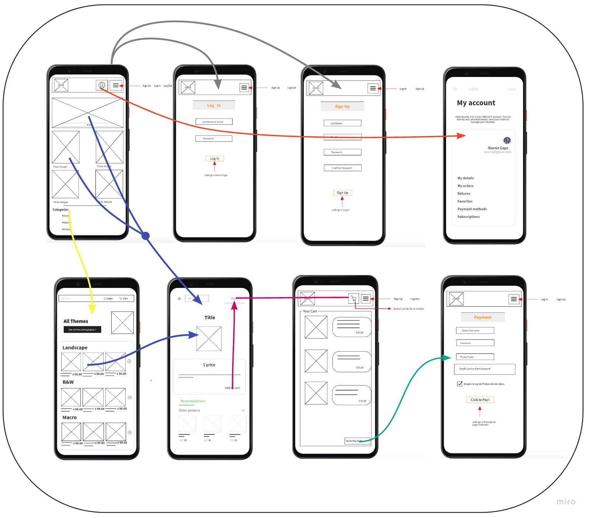

# S.M Photograpy

## Description
Our APP is an e-commerce application aimed at people passionate about photography.
S.M Photography was developed using Back-end dev(Node.js) as part of the [Ironhack](https://www.ironhack.com/) developer bootcamp (WebDev-FT-0920) using a local Data Base.

## User Stories

- **404** - As a user I want to see a nice 404 page when I go to a page that doesn’t exist so that I know it was my fault 
- **500** - As a user I want to see a nice error page when the super team screws it up so that I know that is not my fault
- **homepage** - As a user I want to be able to access the homepage so that I see what the app is about and login and signup
- **sign up** - As a user I want to sign up on the webpage so that I can see all the events that I could attend
- **login** - As a user I want to be able to log in on the webpage so that I can get back to my account
- **logout** - As a user I want to be able to log out from the webpage so that I can make sure no one will access my account
- **events list** - As a user I want to see all the events available so that I can choose which ones I want to attend
- **events create** - As a user I want to create an event so that I can invite others to attend
- **events detail** - As a user I want to see the event details and attendee list of one event so that I can decide if I want to attend 
- **event attend** - As a user I want to be able to attend to event so that the organizers can count me in

## Backlog    
- Partnership with a lab printer.

## Wireframes    



## ROUTES:

- GET / 
  - renders the homepage
- GET /auth/signup
  - redirects to / if user logged in
  - renders the signup form (with flash msg)
- POST /auth/signup
  - redirects to / if user logged in
  - body:
    - username
    - email
    - password
- GET /auth/login
  - redirects to / if user logged in
  - renders the login form (with flash msg)
- POST /auth/login
  - redirects to / if user logged in
  - body:
    - username
    - password
- POST /auth/logout
  - body: (empty)

- GET /events
  - renders the event list + the create form
- POST /events/create 
  - redirects to / if user is anonymous
  - body: 
    - name
    - date
    - location
    - description
- GET /events/:id
  - renders the event detail page
  - includes the list of attendees
  - attend button if user not attending yet
- POST /events/:id/attend 
  - redirects to / if user is anonymous
  - body: (empty - the user is already stored in the session)


## Models

User model
 
```
username: String
email: String
password: String
```

Event model

```
title: String
description: String
price: Number
favorite: Boolean
attendees: [ObjectId<User>]
```

## Links


### Trello (list of tasks)
[Link url](https://trello.com/b/QUSSw8w0/projecte-n2-ironhack)


### Github
URls for the project repo and deploy
[Link Repo](https://github.com/Lexirem/Project-2)
[Link Deploy](http://github.com)


### Slides
URls for the project presentation (slides)
[Link Slides.com](http://slides.com)